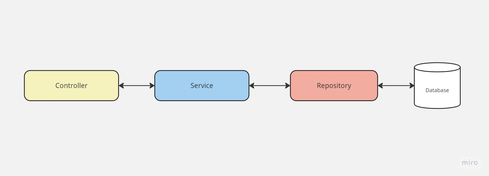

# +A Educação - Full Stack Web Developer

## Decisão da arquitetura utilizada

Este projeto usa o framework NestJS, que tem sua arquitetura baseada em repository pattern, sendo da seguinte forma:

O projeto foi ao ar utilizando o serviço Cloud Run da Google Cloud Platform

### Lista de bibliotecas de terceiros utilizadas

- NestJS e suas dependências
- cpf-cnpj-validator para validar os cpfs recebidos
- bcrypt para hashing de senhas

### O que você melhoraria se tivesse mais tempo

- Adicionaria testes de integração
- Melhoraria o algoritmo de geração de RAs, não usando valores sequenciais

### Quais requisitos obrigatórios que não foram entregues

Foi alinhado em entrevista que o front-end poderia ser feito em qualquer framework pois se trata de uma vaga back-end. Mesmo na documentação dizendo que deveria ser feito em Vue.js.

